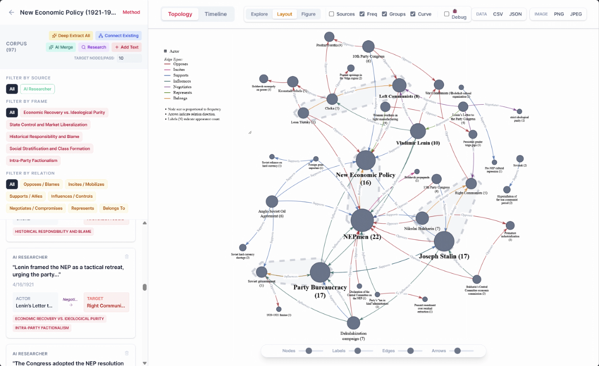
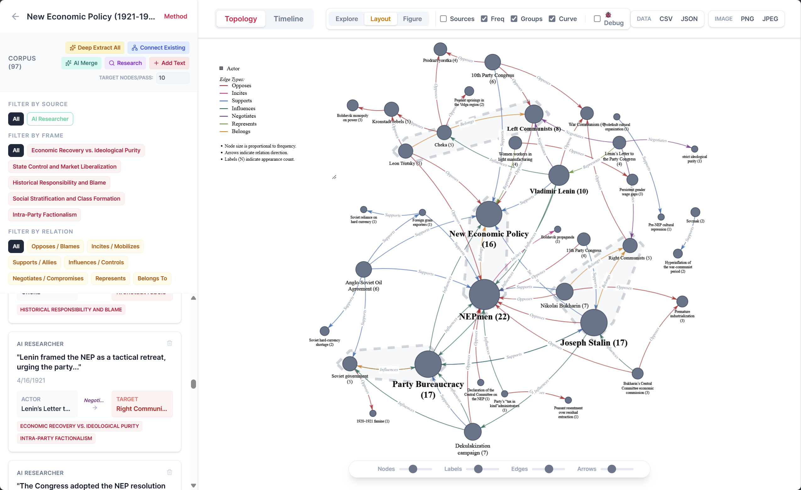

# Trace

**[English](#english) | [中文](#%E4%B8%AD%E6%96%87)**

---

<p align="center">
  
</p>
<p align="center">
  
</p>


<h2 id="english">🇬🇧 English</h2>

**Compare how different media frame the same event.**

Trace is an open-source, local-first analytical web application designed for academic researchers, media analysts, and political scientists. It allows users to structurally compare how different institutional media construct distinct geopolitical or ideological realities from the exact same raw event.

### 🌟 Key Features

- **Automated Framing Extraction**: Utilizes LLMs to extract narrative frames, main actors, and blame targets from news articles.
- **Blame Topology Visualization**: Automatically generates an interactive network graph (Topology) showing attribution direction and framing relationships.
- **Local-First & Privacy-Focused**: No backend or external databases. All your research data is stored securely in your browser's local storage.
- **i18n Support**: Native English and Chinese UI switching.

### 🛠️ Features Overview

**1. Dashboard (Project Management)**
- **Dual-Mode AI Configuration**: Seamlessly switch between cloud APIs (e.g., OpenAI) and local models (e.g., LM Studio, Ollama) directly in the browser.
- **Project Isolation**: Manage multiple research topics as distinct projects with isolated data and topologies.

**2. Data & Article Manager (Core Tools)**
- **Add Text**: Manually paste raw text or drag-and-drop files (PDF, DOCX, TXT, EPUB) to add new source materials to your project.
- **Research**: Use the AI to automatically gather background contexts, simulate different perspectives, or generate synthetic articles related to your topic.
- **Deep Extract All**: The primary extraction engine. It reads through all unprocessed articles line-by-line to extract `Actors`, `Narrative Frames`, `Tones`, and complex `Blame/Support Relationships`.
- **Connect Existing**: Forces the AI to re-read the articles specifically looking for hidden relationships between the *already discovered* entities in your network, enriching the topology without adding noise.
- **AI Merge**: A powerful deduplication tool. It commands the LLM to identify and merge synonymous entities extracted from different articles (e.g., merging "US Govt" and "USA" into a single node) to clean up the network structure.
- **TARGET NODES/PASS**: A slider/input that controls the density of the extraction. Higher numbers force the AI to extract more entities per article, while lower numbers focus only on the most critical actors.

**3. Topology Visualization**
- **Interactive Narrative Network**: View the complex web of who is blaming whom, colored by narrative frames and tones.
- **Manual Mode**: Drag nodes to pin them in place. Click a pinned node to unpin it and let physics take over.
- **Explore Mode**: Click any node to isolate its "Ego-Network", highlighting only its direct connections.
- **View Controls**: Toggle the visibility of Source articles, switch between straight/curved edges, group nodes by modularity classes, or scale nodes by frequency.
- **Export**: Export the entire dataset as JSON/CSV or capture high-resolution PNG/JPEG images of your topology for academic papers.

### 🚀 Quick Start

1. Clone this repository:
   ```bash
   git clone https://github.com/yourusername/Trace.git
   cd Trace
   ```
2. Install dependencies:
   ```bash
   cd app
   npm install
   ```
3. Start the local server:
   ```bash
   npm run dev
   ```
4. Click `Trace.exe` (or `Trace.command` in Mac/Linux) in the root folder to launch the application. Or open `http://localhost:5173`.

### 📖 Tutorial

1. **Configure API**: Click the settings icon to set up your LLM provider (e.g., OpenAI, LM Studio, Ollama). All data is processed locally in your browser.
2. **Create Project**: Click "New Project" and define the event or topic you want to analyze.
3. **Ingest Data**: In the Data & Article Manager, use **Add Text** or **Research** to gather source materials.
4. **Run Analysis**: Set your **TARGET NODES/PASS** and click **Deep Extract All** to extract the initial network. Use **Connect Existing** to discover hidden links, and run **AI Merge** to clean up duplicate entities.
5. **Explore Topology**: Switch to the **Topology** tab. Use **Manual Mode** to drag and pin nodes, or **Explore Mode** to click and highlight specific sub-networks.
6. **Filter & Export**: Use the left sidebar to filter by source, frame, or relation type. Export your data (JSON/CSV) or save the topology as a high-resolution image (PNG/JPEG).


---

<h2 id="中文">🇨🇳 中文</h2>

**比较不同来源如何构建同一事件的叙事**

Trace 是一个基于本地的 AI 分析工具，专为研究人员、媒体分析师设计。它可以帮助用户对相同事件在不同媒体机构下的框架构建和叙事差异进行结构化的图谱比较。

### 🌟 核心功能

- **自动化叙事提取**：利用大语言模型（LLM）从新闻文本中提取叙事框架、主要行动者及指责对象。
- **指责拓扑图可视化**：自动生成交互式的网络拓扑图，展示归因方向和框架关系。
- **本地优先与隐私保护**：无后端、无外部数据库。您的所有分析数据均安全地保存在浏览器的本地存储中。
- **多语言支持**：原生支持中文与英文界面一键切换。

### 🛠️ 功能详解

**1. 仪表盘 (项目管理)**
- **本地/云端双擎配置**：在浏览器中无缝切换云端大模型 API（如 OpenAI）或本地私有模型（如 LM Studio, Ollama）。
- **项目隔离管理**：将不同的研究主题作为独立的项目进行管理，数据与拓扑图互不干扰。

**2. 数据与文献管理器 (核心操作盘)**
- **添加文本 (Add Text)**：支持手动粘贴纯文本，或直接拖拽 PDF、DOCX、TXT、EPUB 等文件到界面中，将其添加为原始素材。
- **自动研究 (Research)**：让 AI 根据您的主题，自动在后台生成不同立场的模拟文章或检索相关背景上下文。
- **深度提取全部 (Deep Extract All)**：核心提炼引擎。它会逐行阅读所有未处理的文献，自动提炼出其中的 `行动者(Actors)`、`叙事框架(Frames)`、`情感基调(Tones)` 以及复杂的 `指责/支持关系`。
- **连接现有节点 (Connect Existing)**：要求 AI 重新阅读文献，但这一次只专注于寻找**已经存在于图谱中**的实体之间的隐藏关系。这可以在不增加新节点噪音的情况下，极大丰富网络的连通性。
- **AI 实体合并 (AI Merge)**：强大的图谱净化工具。调用大模型智能判断并合并来自不同文章的同义实体（例如将“美国政府”和“合众国”合并为一个节点），以此消除冗余节点。
- **单次提取密度 (TARGET NODES/PASS)**：控制 AI 提取粒度的参数。调高此数值会强制 AI 从每篇文章中提取更多的边缘节点；调低则只会提取最核心的关键行动者。

**3. 拓扑图可视化 (Topology View)**
- **交互式叙事网络**：通过物理引力引擎，可视化复杂的“谁在指责谁”关系网，并根据叙事框架和情感基调自动着色。
- **手动排版 (Manual Mode)**：拖拽节点以将其固定在特定位置，帮助您梳理清晰的版面；点击已固定的节点即可解除固定。
- **探索模式 (Explore Mode)**：点击任意节点即可高亮其“局部网络（Ego-Network）”，隐藏无关的噪音信息。
- **高级控制视图**：一键切换显示文献来源节点 (Sources)、开关连线曲线 (Curve)、按算法聚类分组 (Groups) 或按出现频次缩放节点大小 (Freq)。
- **一键导出**：支持将底层结构化数据导出为 JSON/CSV 格式，或将当前的排版直接保存为超清 PNG/JPEG 图片，方便直接插入学术论文。

### 🚀 快速开始

1. 克隆本仓库：
   ```bash
   git clone https://github.com/yourusername/Trace.git
   cd Trace
   ```
2. 安装依赖：
   ```bash
   cd app
   npm install
   ```
3. 运行本地服务：
   ```bash
   npm run dev
   ```
4. 直接点击根目录下的 `Trace.exe` (Mac/Linux 下为 `Trace.command`) 即可启动。或者直接在浏览器打开 `http://localhost:5173`。

### 📖 使用教程

1. **配置 API**：点击右上角设置图标配置您的大语言模型（支持 OpenAI, LM Studio, Ollama 等）。数据全程在本地浏览器处理。
2. **创建项目**：点击“New Project”创建一个新项目，设定您要分析的主题。
3. **导入数据**：进入项目后，使用控制台的 **添加文本 (Add Text)** 导入自有文献，或点击 **自动研究 (Research)** 让 AI 帮您收集上下文。
4. **运行分析**：设定好 **单次提取密度 (TARGET NODES/PASS)**，点击 **深度提取全部 (Deep Extract All)** 开始提炼叙事网络。您还可以使用 **连接现有节点 (Connect Existing)** 挖掘潜在关联，最后通过 **AI 实体合并 (AI Merge)** 清洗冗余节点。
5. **探索拓扑图**：切换到 **拓扑图 (Topology)** 标签页。使用 **手动排版 (Manual)** 拖拽梳理网络，或在 **探索 (Explore)** 模式下点击节点查看局部关系。
6. **筛选与导出**：通过侧边栏过滤不需要的连线，排版完成后，即可将分析结果导出为结构化数据或高清大图。


## 🛡️ License

**Trace** is distributed under a **Dual License** model:

1. **GNU AGPLv3 License** (Open Source)
   - Free for personal, academic, and non-commercial use.
   - You are free to modify and distribute the code, provided that any derivative works are also open-sourced under the AGPLv3 license. (See the [LICENSE](./LICENSE) file for details).

2. **Commercial License**
   - If you wish to use Trace in a commercial product, integrate it into a closed-source service, or avoid the restrictive terms of the AGPLv3 license, you must obtain a commercial license.
   - Please contact **tonf.academic@gmail.com** to discuss commercial licensing options.

## 📞 Contact

If you have any questions or feedback, please contact: **tonf.academic@gmail.com**
